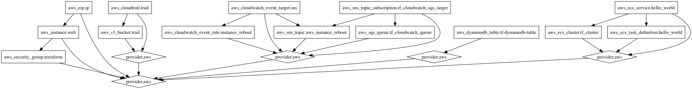

Install terraform
``` bash
brew install terraform
```

Setup aws credentials
``` bash
curl "https://s3.amazonaws.com/aws-cli/awscli-bundle.zip" -o "awscli-bundle.zip"
unzip awscli-bundle.zip
$ ./awscli-bundle/install -b /usr/local/bin/aws
aws configure
```

Generate graph for aws setup
``` bash
brew install graphviz
terraform graph | dot -Tpng > graph.png
```
